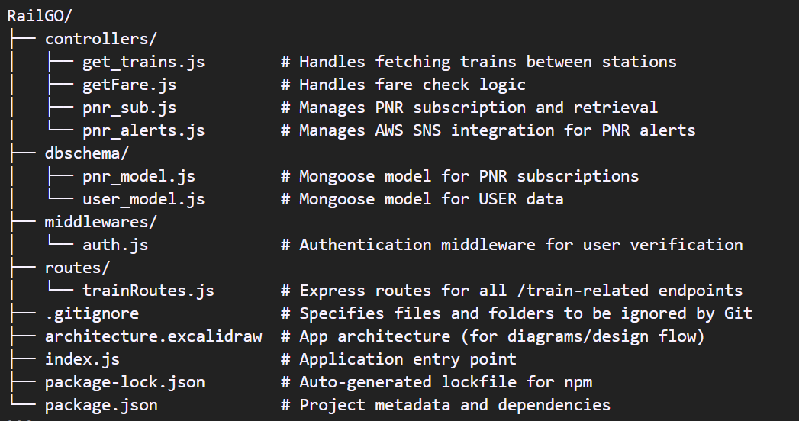

# OneRail

OneRail is a Node.js and Express-based backend application that allows users to:

- Search for trains between stations
- Check fares and seat availability
- Subscribe to PNR status tracking
- Receive alerts (via email/logs) if train status changes

## Table of Contents

- [Project Structure](#project-structure)
- [Endpoints](#endpoints)
  - [User Routes](#user-routes)
    - [Sign Up](#sign-up)
    - [Sign In](#sign-in)
  - [Train Routes](#train-routes)
    - [Search Trains](#search-trains)
    - [Check Fare](#check-fare)
    - [Subscribe PNR](#subscribe-pnr)
- [AWS SES Integration](#aws-ses-integration)
- [Getting Started](#getting-started)
  - [Prerequisites](#prerequisites)
  - [Installation](#installation)
- [Testing](#testing)

## Project Structure



## Endpoints

### User Routes

Base URL: `/api/v1/user`

#### Sign Up

- **Endpoint**: `/signup`
- **Method**: POST
- **Body**: `{ "email": "you@example.com", "username": "yourname", "password": "yourpassword" }`
- **Description**: Creates a new user account.

#### Sign In

- **Endpoint**: `/signin`
- **Method**: POST
- **Body**: `{ "email": "you@example.com", "password": "yourpassword" }`
- **Description**: Returns a JWT (`token`) valid for 7 days. Send this token on the `token` header for all Train Routes below.

### Train Routes

Base URL: `/api/v1/train`

All routes below require a valid JWT from `/signin` sent on the `token` request header.

#### Search Trains

- **Endpoint**: `/checktrains`
- **Method**: GET
- **Query Parameters**:
  - `fromStationCode`: Source station code (e.g., `CNB`)
  - `toStationCode`: Destination station code (e.g., `NDLS`)
  - `date`: Date of journey (e.g., `2026-08-25`)
- **Description**: Retrieves a list of trains operating between the specified stations on the given date.

#### Check Fare

- **Endpoint**: `/checkfare`
- **Method**: GET
- **Query Parameters**:
  - `trainNo`: Train number (e.g., `12034`)
  - `fromStationCode`: Source station code (e.g., `NDLS`)
  - `toStationCode`: Destination station code (e.g., `CNB`)
- **Description**: Fetches fare details for the specified train and route.

#### Subscribe PNR

- **Endpoint**: `/subscribe-pnr`
- **Method**: POST
- **Body**: `{ "pnrNumber": "2810651211" }`
- **Description**: Subscribes to PNR status tracking. Upon subscription, the system fetches PNR details, stores them in the database, and emails the subscriber.

## AWS SES Integration

The application uses AWS Simple Email Service (SES) — via AWS SDK for JavaScript v3 — to send a confirmation email when a user subscribes to a PNR, with the PNR details in the body.

**Note**: Set `SES_FROM_EMAIL` to an identity (email address or domain) verified in your SES account. If your SES account is still in the sandbox, recipient addresses must also be verified before they can receive mail; request production access to email arbitrary addresses.

## Getting Started

### Prerequisites

- Node.js (v14 or above)
- npm (Node Package Manager)
- MongoDB (for storing PNR subscriptions)
- AWS Account with SES permissions (for email notifications)

### Installation

### 1. Clone the repository

`git clone https://github.com/d3vyansh/OneRail.git`
`cd OneRail`

### 2. Install dependencies

`npm install`

### 3. Create a `.env` file in the root directory and add the following:

```
PORT=3000
mongoURL=your_mongodb_connection_string
JWT_SECRET=your_jwt_secret
xrapid_apikey=your_rapidapi_key
AWS_ACCESS_KEY_ID=your_aws_access_key
AWS_SECRET_ACCESS_KEY=your_aws_secret
AWS_REGION=your_preferred_region (e.g. ap-south-1)
SES_FROM_EMAIL=your_verified_ses_sender_email
ALLOWED_ORIGINS=http://localhost:5173
```

`ALLOWED_ORIGINS` is a comma-separated list of origins allowed to call this API from a browser (e.g. your frontend's dev and production URLs). Leave it unset to block all browser origins while still allowing server-to-server calls and tools like curl/Postman.

Signup and signin are rate-limited to 10 requests per 15 minutes per IP.

## 4. Start the server

`node index.js`

## Testing

The test suite mocks the database layer, the IRCTC RapidAPI calls, and the AWS SES client, so it runs fully offline — no MongoDB or AWS credentials required.

```
npm test              # run the suite once
npm run test:watch    # re-run on file changes
npm run test:coverage # run with a coverage report
```

